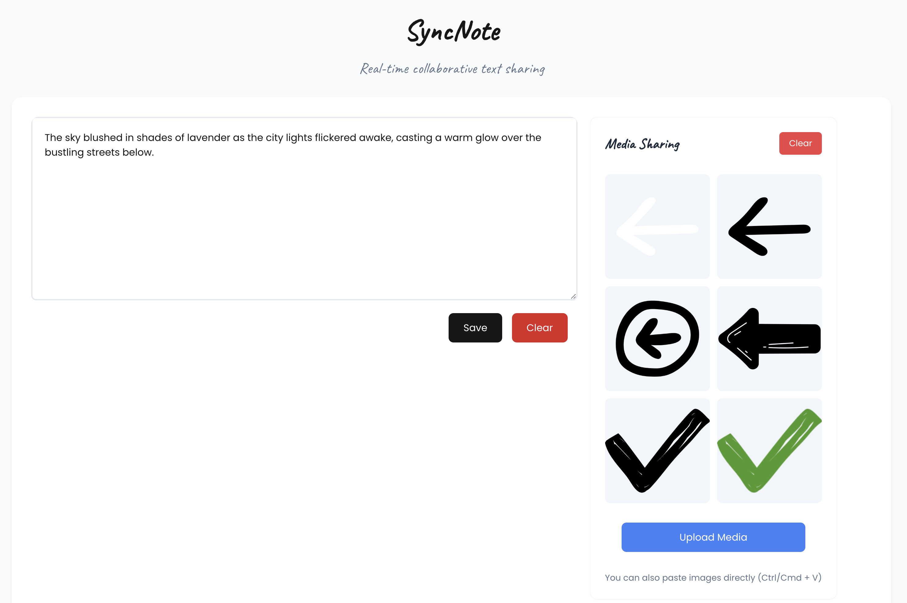

# Welcome to SyncNote! 🎉



<div style="text-align: center;">
  Welcome to SyncNote! 🎉
</div>

&nbsp;  
&nbsp;  

SyncNote is your go-to real-time collaborative platform for sharing text and media with your friends, colleagues, or that one person who always forgets to save their work. With SyncNote, you can share notes, images, and collaborate in real-time like a pro!

## Getting Started 🚀

First things first, let’s get this party started by running the development server:

```bash
npm run dev
# or
yarn dev
# or
pnpm dev
# or
bun dev
```

Once you’ve got that running, open [http://localhost:3000](http://localhost:3000) in your favorite browser. You’ll be greeted with a beautiful interface where the magic happens!

## What’s Under the Hood? 🔧

### APIs You’ll Need

SyncNote is powered by some cool APIs that make everything work seamlessly:

- **Firebase Firestore**: We need this API to store and sync your text and media data in real-time.

- **Cloudinary**: This is our go-to for all things media. We need the Cloudinary API to set up an unsigned upload preset, allowing you to upload images or simply paste media effortlessly.

---

So, what are you waiting for? Get started with SyncNote and make collaboration fun and easy! 🎈
